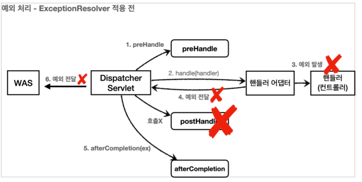
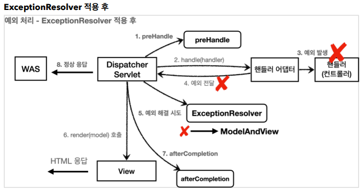

# 스프링부트 예외 처리

BasicErrorController가 기본적으로 동작하면서 예외처리를 해준다.  
컨트롤러에서 예외가 발생했을 때 MediaType이 text/html인 경우 에러 넘버에 일치하는 html 뷰를 반환한다.  
html 뷰는 /src/main/resources/templates/error/404.html 와 같은 경로에 위치해야 한다.

MediaType이 application/json인 경우 responseEntity로 Map을 반환한다.

## HandlerExceptionResolver

예외가 발생하여 서블릿을 넘어 WAS까지 예외가 전달되면 HTTP 상태코드가 500으로 처리된다.  
하지만, 발생하는 예외에 따라서 400, 403, 404 등으로 처리해야 할 필요성도 존재한다.

이럴 때 사용하는 것이 HandlerExceptionResolver이다.  
HandlerExceptionResolver 인터페이스를 구현하고 resolveException 메서드를 오버라이딩하여 커스터마이징 하면 된다.

### HandlerExceptionResolver 사용 전 MVC 패턴 동작과정



1. DispatcherServlet -> preHandle
2. 핸들러 어댑터 -> 핸들러 컨트롤러 -> 예외 발생!!
3. DispatcherServlet은 예외를 전달 받고 postHandle을 호출하지 않은 채로 afterCompletion 호출

### HandlerExceptionResolver 사용 후 MVC 패턴 동작과정



1. DispatcherServlet -> preHandle
2. 핸들러 어댑터 -> 핸들러 컨트롤러 -> 예외 발생!!
3. DispatcherServlet은 예외를 전달 받고 postHandle을 호출하지 않은 채로 ExceptionResolver 호출(예외 해결 시도)
4. afterCompletion 호출

* 참고: postHandle은 예외가 발생하면 어떠한 경우에도 호출되지 않는다.

### 예제

```java

@Slf4j
public class MyHandlerExceptionResolver implements HandlerExceptionResolver {
    @Override
    public ModelAndView resolveException(HttpServletRequest request, HttpServletResponse response, Object handler, Exception ex) {
        try {
            if (ex instanceof IllegalArgumentException) {
                log.info("IllegalArgumentException resolver to 400");
                response.sendError(HttpServletResponse.SC_BAD_REQUEST,
                        ex.getMessage());
                return new ModelAndView();
            }
        } catch (IOException e) {
            log.error("resolver ex", e);
        }
        return null;
    }
}
```

### 반환 값에 따른 동작 방식

HandlerExceptionResolver의 반환 값에 따른 DispathcerServlet의 동작 방식은 세 가지로 나뉜다.

1. Empty ModelAndView
    - new ModelAndView()을 반환하면 뷰를 렌더링 하지 않고, 정상 흐름으로 서블릿이 리턴된다.
2. ModelAndView 지정
    - View, Model을 넣어 반환하면 일치하는 뷰를 렌더링한다.
3. null
    - null을 반환하면 다음 ExceptionResolver를 찾아서 실행한다. 만약 다음 ExceptionResolver가 없으면 500 에러로 처리된다.

## 스프링이 제공하는 ExceptionResolver 3가지

스프링 부트가 기본으로 3가지의 ExceptionResolver을 제공한다.  
각각 우선 순위가 존재하며 우선 순위가 높은 순서는 아래와 같다.

1. ExceptionHandlerExceptionResolver
2. ResponseStatusExceptionResolver
3. DefaultHandlerExceptionResolver

### DefaultHandlerExceptionResolver

DefaultHandlerExceptionResolver는 스프링 내부에서 발생하는 스프링 예외를 해결한다.  
대표적으로 파라미터 바인딩 시점에 타입이 맞지 않으면 내부에서 TypeMismatchException 이 발생하는데, 이 경우 예외가 발생했기 때문에 그냥 두면 서블릿 컨테이너까지 오류가 올라가고, 결과적으로 500
오류가 발생한다.  
그런데 파라미터 바인딩은 대부분 클라이언트가 HTTP 요청 정보를 잘못 호출해서 발생하는 문제이다.  
HTTP 에서는 이런 경우 HTTP 상태 코드 400을 사용하도록 되어 있다. DefaultHandlerExceptionResolver 는 이것을 500 오류가 아니라 HTTP 상태 코드 400 오류로 변경한다.

내부적으로 response.sendError(HttpServletResponse.SC_BAD_REQUEST)를 통해 처리한다.  
결국 response.sendError()를 사용하여 처리한다.

### ResponseStatusExceptionResolver

ResponseStatusExceptionResolver는 예외에 따라서 HTTP 상태 코드를 지정해주는 역할을 한다.  
다음 두 가지 경우를 처리한다.

1. @ResponseStatus 어노테이션이 달려있는 예외
2. ResponseStatusException 예외


```java

@ResponseStatus(code = HttpStatus.BAD_REQUEST, reason = "잘못된 요청 오류")
    public class BadRequestException extends RuntimeException {
}
```
BadRequestException 예외가 컨트롤러 밖으로 넘어가면 ResponseStatusExceptionResolver 예외가
해당 애노테이션을 확인해서 오류 코드를 HttpStatus.BAD_REQUEST (400)으로 변경하고, 메시지도
담는다.
ResponseStatusExceptionResolver 코드를 확인해보면 결국 response.sendError(statusCode,
resolvedReason) 를 호출하는 것을 확인할 수 있다.  
sendError(400) 를 호출했기 때문에 WAS에서 다시 오류 페이지( /error )를 내부 요청한다.

* 참고: @ResponseStatus의 reason은 MessageSource에서 찾는 기능도 제공한다.

### ExceptionHandlerExceptionResolver
@ExceptionHandler이 붙은 메서드를 찾아서 예외를 처리한다.  
@ControllerAdvice 또는 @RestControllerAdvice를 사용해서 API 코드와 예외처리 코드를 분리시킬 수 있다.  

#### 예제
```java
// ApisExceptionHandler.class

@RestControllerAdvice // 대상을 지정하지 않으면 모든 컨트롤러에 적용된다.(글로벌)
//@RestControllerAdvice(annotations = RestController.class) // RestController한테만 적용
//@RestControllerAdvice(패키지) // 지정한 패키지 내 컨트롤러에만 적용
//@RestControllerAdvice(assignableTypes = {A.class, B.class}) // 직접 어떤 컨트롤러한테 적용할 때
public class ExControllerAdvice {

    @ResponseStatus(HttpStatus.BAD_REQUEST)
    @ExceptionHandler
    public ErrorResult IllegalArgumentExceptionHandler(IllegalArgumentException e) {
        // 현재 컨트롤러에서 IllegalArgumentException을 상속받은 클래스의 예외까지 잡아준다.
        return new ErrorResult("파라미터 누락", e.getMessage());
    }

    @ExceptionHandler
    public ResponseEntity<ErrorResult> userExceptionHandler(UserException e) {
        // 현재 컨트롤러에서 UserException을 상속받은 클래스의 예외까지 잡아준다.
        ErrorResult errorResult = new ErrorResult("USER-EX", e.getMessage());

        // Http 응답 코드를 동적으로 변경할 수 있다.
        return new ResponseEntity<>(errorResult, HttpStatus.BAD_REQUEST);
    }

    @ResponseStatus(HttpStatus.INTERNAL_SERVER_ERROR)
    @ExceptionHandler
    public ErrorResult exceptionHandler(Exception e) {
        // 나머지 예외는 현재 메서드가 잡는다.
        return new ErrorResult("EX", "내부오류");
    }

}
```