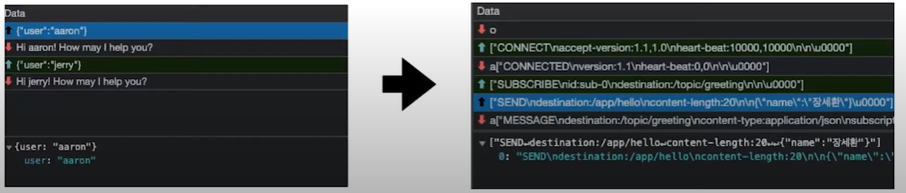
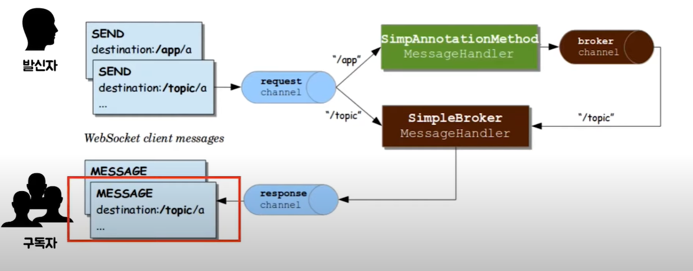

https://spring.io/guides/gs/messaging-stomp-websocket/#initial 참고
## 웹 소켓이란?
- W3C와 IETF에 의해 자리잡은 표준 프로토콜 중 하나
- 두 프로그램 간 메시지를 교환하기 위한 통신 방법 중 하나
- HTML5에서 많이 사용된다.

## 특징
- 클라이언트와 서버가 양방향 통신(Full-Duplex)이 가능하다.
  - HTTP는 클라이언트가 서버에 데이터를 요청하는 단방향 통신만 가능하지만, 웹소켓은 양방향 통신을 지원한다.
- 실시간 네트워크 통신
  - 주식, 채팅, 비디오 등에 사용된다.

## 웹 소켓 이전의 비슷한 기술
1. Polling
   - 클라이언트가 서버에 일정한 주기로 요청을 송신한다.
   - 불필요한 request, connection을 생성한다는 문제점 존재(요청을 보내도 돌아오는 응답은 동일하므로 리소스 낭비)
2. Long Polling
   - 클라이언트가 서버에 일정한 주기로 요청을 송신한 후, 이벤트가 생겨 응답을 받기 전까지 연결을 종료하지 않음.
   - 응답을 받으면 끊고 다시 재요청
   - 많은 양의 데이터가 쏟아지면 Polling과 동일함
3. Streaming
   - 클라이언트가 서버에 요청을 보내고 끊기지 않은 상태에서 끊임없이 데이터를 수신
   - 클라이언트에서 서버로의 데이터 송신이 어렵다는 문제 존재

**공통적인 문제점**은 빠른 데이터 주고 받기가 필요한데 HTTP 통신이므로 Header가 불필요하게 큼 

## 웹 소켓의 동작 과정
1. Hand Shaking
    - 클라이언트와 서버가 웹 소켓 통신을 하기 전에 처음 한 번의 연결이 필요한데, 이는 HTTP 통신으로 커넥션을 맺는다.
```java
// Client
GET /chat HTTP/1.1
    Host: server.example.com
    Upgrade: websocket
    Connection: Upgrade
    Sec-WebSocket-Key: dPGq7SBivsS90wnXgsgjdvny37sfRG7esj8
    Origin: http://example.com
    Sec-WebSocket-Protocol: chat, superchat
    Sec-WebSocket-Version: 13
```
- **Host**: 웹 소켓 서버의 주소
- **Upgrade**: 현재 프로토콜에서 다른 프로토콜로 업그레이드 또는 변경하기 위한 규칙
- **Connection**: Upgrade 헤더가 명시되어 있으면 송신자는 반드시 Upgrade 옵션을 지정한 Connection 헤더 필드도 전송해야 함
- **Sec-WebSocket-Key**: 클라이언트와 서버 간의 신원 인증. 길이가 16바이트인 임의의 숫자를 base64로 인코딩한 값
- **Origin**: 클라이언트의 주소
- **Sec-WebSocket-Protocol**: 클라이언트가 요청하는 서브 프로토콜을 의미하며 순서에 따라 우선권이 부여된다. 서버는 저 목록 중에서 지원하는 서브 프로토콜 목록을 응답함.

```java
// Server
HTTP/1.1 Switching Protocols
    Upgrade: websocket
    Connection: Upgrade
    Sec-WebSocket-Accept: s3ptPLMafbkskfjbskv
```
- **Sec-WebSocket-Accept**: 클라이언트로 전달받은 Sec-WebSocket-Key 값을 사용하여 계산된 값
- 핸드쉐이킹이 끝나면 프로토콜이 ws(80), wss(443)로 변경이 된다. 
  - wss는 ws에 SSL 적용된 프로토콜이다.

2. 프레임이로 구성된 메시지라는 논리적 단위로 송수신
   - 메시지에 포함될 수 있는 교환 가능한 메시지는 텍스트와 바이너리이다.

## 웹소켓 한계
- HTML5 이전의 기술로 구현된 서비스에서는 웹 소켓을 사용할 수 없기에 Socket.io, SockJS를 통해 웹 소켓처럼 사용할 수 있다.

## STOMP(Simple Text Oriented Message Protocol)
- 메시지 브로커를 활용하여 쉽게 메시지를 주고 받을 수 있는 프로토콜
  - Pub-Sub
  - 메시지 브로커: 발신자의 메시지를 받아와서 수신자들에게 메시지를 전달하는 주체(말 그대로 브로커이다)
- 웹 소켓 위에 얹어 함께 사용할 수 있는 하위(서브) 프로토콜

### STOMP를 왜 사용할까?
- 웹 소켓은 텍스트, 바이너리 데이터를 양방향으로 전달하는 프로토콜이다. 하지만 어떤 형식으로 보내야 하는지는 정해져 있지 않다. 
애플리케이션의 규모가 커지면 정해진 형식으로 데이터를 송수신 해야 하는 상황이 온다. 이런 형식을 정해놓은 것이 STOMP이다.
- COMMAND, HEADER, BODY로 나누어져 있다.


- 좌측은 웹 소켓만 사용했을 때의 데이터 송수신
- 우측은 웹 소켓에 STOMP를 얹어 사용했을 때의 데이터 송수신

## 스프링이 STOMP를 사용하는 동작 흐름

- 구독자들은 /topic을 구독하고 있는 상태라고 가정했을 때 구독자들에게 메시지가 전달되는 흐름은 2가지가 존재한다.
    1. 데이터를 가공하지 않고 그대로 /topic 호출
        - 즉시 SimpleBrokerMessageHandler를 거쳐 구독자에게 메시지를 전달한다.
    2. /app을 거쳐 데이터를 가공 후 /topic 호출
        - SimpleAnnotationMethodMessageHandler를 거치고 데이터를 가공 후 SimpleBrokerMessageHandler를 거쳐 구독자에게 메시지를 전달한다.

```java
@Configuration
@EnableWebSocketMessageBroker
public class WebSokcetBrokerConfig implements WebSocketMessageBrokerConfigurer {
    
    @Override
    public void configureMessageBroker(MessageBrokerRegistry registry) {
        registry.enableSimpleBroker("/queue", "/topic");
        registry.setApplicationDestinationPrefixes("/app");
    }
    
    @Override
    public void registerStompEndpoints(StompEndpointRegistry registry) {
        registry.addEndpoint("/gs-guide-websocket").withSockJS();
    }
}
```
- endableSimpleBroker는 스프링이 디폴트로 사용하는 내장 브로커를 사용한다는 의미이다.
    - prefix가 /queue, /topic로 시작되면 해당 브로커가 처리한다.
- setApplicationDestinationPrefixes는 메시지 핸들러로 라우팅 되는 Prefix이다.
- registerStompEndpoints 메서드의 addEndpoint는 핸드쉐이킹을 할 엔드포인트이다.

```java
@Controller
public class GreetingController {

    @MessageMapping("/hello")
    @SendTo("/topic/greetings")
    public Greeting greeting(HelloMessage message) throws Exception {
    Thread.sleep(1000); // simulated delay
    return new Greeting("Hello, " + HtmlUtils.htmlEscape(message.getName()) + "!");
    }

}
```
- /app/hello로 요청이 오면 setApplicationDestinationPrefixes에 prefix로 등록된 '/app'에 매칭된다.
  무조건 @Controller가 붙어 있어야 동작되며, 데이터 payload는 greeting 메서드의 파라미터인 HelloMessage 객체에 담겨 있다.
  데이터를 가공하는 작업을 거치고 Greeting 객체를 만들어 리턴하면 @SendTo("/topic/greeting")에 의해 해당 경로로 메시지를 전달한다.
